# Syllabi Interpreter

#### Team 11 | Project by: Brandon Arriaga, Vaishnavi Kouru, Ace Lavilla, Anhduy Phan

## Overview 

The Syllabi Interpreter is meant to help enhance student producitvity and accountability by extracting important information form a provided Syllabus. 
Below we'll go over overall contributions, diagrams, proposal, code overview, and snapshots of the program in action.

## Contributions

### [Proposal:](https://docs.google.com/document/d/1-qDx8XFAJ5Z65TbwcVLJdTpm15bCwIX3MAAEdbgX7ZU/edit#heading=h.j7dxhyv3ht4d)

#### Brandon Arriaga - Contributions to Plan and Approach for the project, such as coming up with design of UI, team workload, and keeping track of code snapshots as well as to Proposal/Issue and what a user may benefit from using it (Issues that could arise in a real-world scenario and how the Interpreter can help them)
#### Vaishnavi Kouru - Contributions to References, environment suggestions, as well as solutions and how the solution tackles the issue we are trying to solve. Contributions to Proposal/Issue and what the project is about and its main points.
#### Anhduy Phan - Contributions to the list of operations for intended users such as having list operations for a Student user and those for Professor user. 
#### Ace Lavilla - Contributions to intended usage description on the proposal, stating how the proposal is inteded to be used by students and by professors, etc.

### [Project Presentation:](https://docs.google.com/presentation/d/1qu1R7BWXlw2hoM2WQdJhXvBn5K19W1CCnBevrbxpgsA/edit#slide=id.p)

#### Brandon Arriaga - Contributions to project overview, stating Goal of the project and what the purpose of it is. Stated backend tools such as Stanford CoreNLP and ConverAPI.
#### Vaishnavi Kouru - Contributions to design choices and what conventions were followed by our code. As well as error handling that explains how program handles errors or exceptions.
#### Anhduy Phan - Contributions to problems being faced by the group such as any lack of communication or issues that arose during the construction of the program.
#### Ace Lavilla - Contributions to project layout and UI overall, displayed the multiple controllers being used to display program and how it ties together.

### Project Report and Code:

#### Brandon Arriaga - Contributions to project report, creating and editing README. Part of the backend team, helped set up entities for Syllabus class as well as Chat NLP Processor that used Standford NLP to provide output
for user when asking specific questions about syllabus such as textbook or professor contact information. Also contributed to design of frontend, main startup menu for the program. Helped troubleshoot and debug errors.
#### Vaishnavi Kouru - Part of backend team. Contributions to PDF Parser functionality, through the use of ApachePDFBoxm, information such as textbook info, contact info, and important dates were extracted to then be imported to a calendar and to list format. Also contributed to
debugging and troubleshooting errors within the group.
#### Anhduy Phan - Contributions to UI as part of the frontend team, contributed to FXML code with classes like syllabuschatbot.fxml and syllabusclassinfo.fxml
#### Ace Lavilla - Contributions to UI as part of the frontend team, contributed to multiple controllers tied to each other such as the Calendar View Controller, Main Controller, Launch View controller, etc.

### Problem/Issue:

As students, we have a lot of classes with different policies, due dates, expecations, etc. Many students can't rely on Canvas to keep them up to date and more often than not, these students fall behind. Many students have to navigate through each syllabus
individually and this is super time consuming. For professors this can be time consuming as well, they get emails from students who don't read the syllabus and have to repeat themselves multiple times.

### Previous works/Inspirations:

[Syllabuddy](https://www.syllabuddy.com/) - Generates a calendar based on a single sylabus that can be expoerted to google calendar.  
[Course Hack it](https://www.coursehack.it/) - Generates a calenddar based on multiple syllabi

### Operating Environemtns / Intended Usage:

Possible environments:  
- Desktop App (Used)
- Web App
- Website

Intended usage:
Intended to be used as a way for students to keep track of their classes’ midterms, assignments, and finals. It is intended to help students stay on top of assigned units and how it correlates to assignments and exams.  
This will also help students know policies for late work, make up exams and quizzes, etc. It is simply a tool to help college students spend more time on studying rather than trying to understand all of their classes’ syllabus!

### Diagrams:

| Diagram | Description |
| ------------- | ------------- |
| [Use Case Diagram](diagrams/usecasediagram.png) | The Use Case Diagram shows a graphical representation of possible user interactions. The following use case diagram shows user interaction from a student, teacher, and the chatbot. Each user may interact with different or similar scenarios such as a student & teacher uploading a syllabus and extracting information to then configure class information. The chatbot may view and configure class list on what the student/teacher has extracted based on the syllabus provided and use this information to then make any changes based on what the student or teacher asks for. |
| [State Diagram](diagrams/statediagram.png)  | The State Diagram describes the behavior of the program and specific states, such as the reading & extracting of syllabus information. This state diagram starts of at an initial state of no syllabus attached, this is where the user then provides a syllabus to be read. The syllabus provided will then be read and either yield any errors or be ready for extraction. The state of extraction then will begin once the syllabus file is read completely, first the file components will be extracted, then a schedule will be created. Finally, the schedule will be imported to the desired calender (Google Calendar, Outlook calendar, etc.) and then be in an off state after all imports are done. |
| [Sequence Diagram](diagrams/sequencediagram.png)  | The Sequence Diagram shows how all operations are carried out in their specific order. The sequence diagram follows the sequence of user,reader, and database. The diagram begins with the user providing a file to be read by the reader who then updates the database with the new syllabus file. If the file is processed correctly then it will update the database, otherwise the user must attach file again. It will then let the user select certain settings such as notifications and other configurations to then update the database with said configurations set by the user. Finally, all changes will be confirmed by user. |
| [Class Diagram](diagrams/classdiagram.jpeg) | The Class Diagram displays all of the program's classes, attributes, methods, and relationships they have among each other. The current class diagram demonstrates the possible classes, methods, and functions that may be used in the program. Some classes for FXML Controllers and GUI, methods and classes that involve the parsing of files, etc. |

### Functionality:

Again, all the information from a student’s syllabi will be conglomerated into a single application that handles: generating calendars, possibly sending reminders, and answering questions that are answered in those documents. 

### Operations:

Student:
 - Configuration: Upload Syllabi, Provide additional info, Manage notifications on/off
 - Calendar use: Organize by week or month
 - Talking to bot and answering questions
 - Receive/Mute notifications

Professor:
- Configuration: Upload syllabi, provide addtional information.
- Create calendar and adds information related to their class
- Having syllabi ready for students to review

### Solution:

Syllabi Interpreter solves the problem/issue that we mentioned in the beginning, the interpreter will organize all the class due dates, policies, etc. into a calendar or list and allow the student to keep track of all their homework, tests, and important policies  
taht way they can stay on top of their classes and professors can spend their time productively as well.

## How to run Syllabi Interpreter:

First, after cloning the repository make sure that you load all Maven dependencies before running anything! Below is how you can do so: 

You can go to where your pom.xml file is located at  
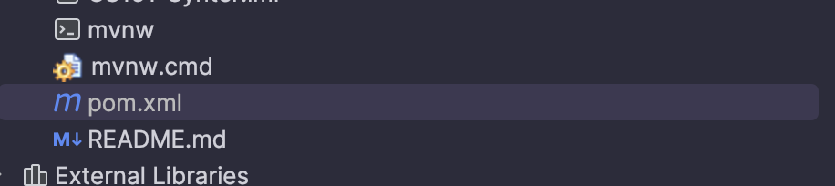 

Now, right click your pom.xml file and you will be prompted with another menu where you should look for 'Maven' and click on that.   After clicking on Maven there 
should be another option that says 'Reload Project', click that and all dependencies will install to the current project if not already installed.  
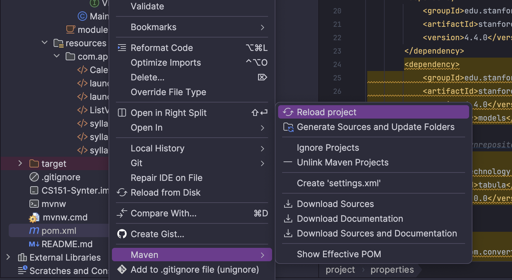 

Another alternative is to click the Maven logo on the right hand side of your IntelliJ IDE and click the Reload symbol  
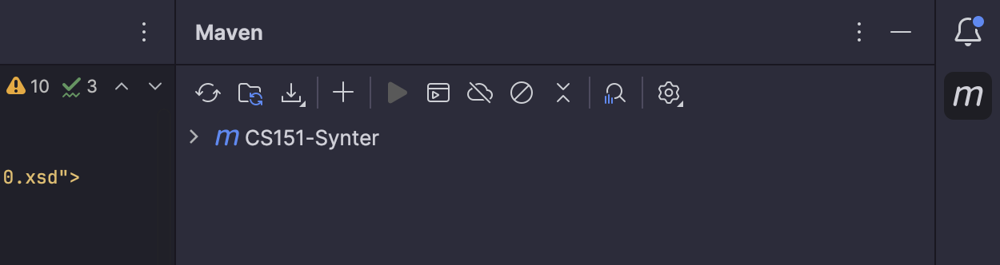 

There is also an option to reload the project and update all dependencies when you're on the Main Controller class, click that before running if you couldn't reload otherwise!  

In order to run the Interpreter, you run the program through the Main Cotroller java class as shown below.:  

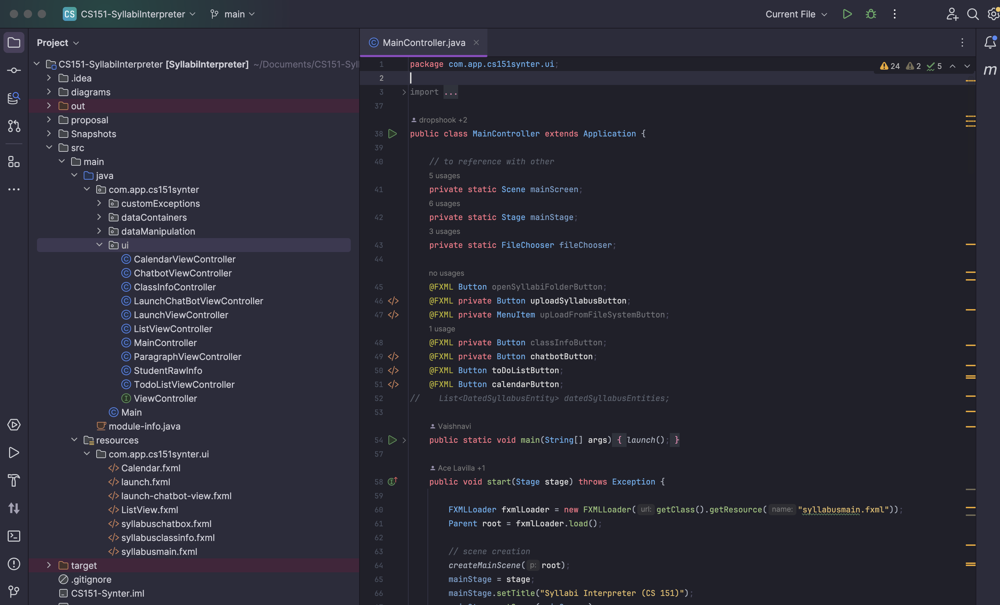  

Once you run the Main class, you will be prompted to the Syllabi Intepreter main page:  

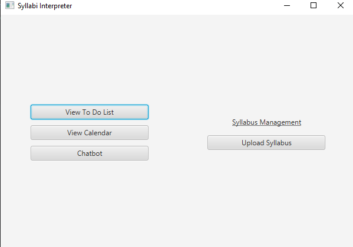  

After clicking 'Upload Syllabus' you will be prompted to your File Explorer where you can submit a syllabus pdf:  

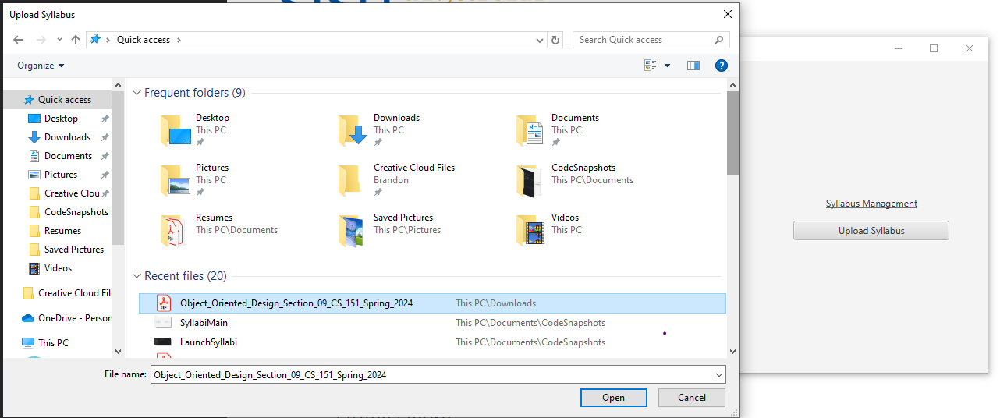

The snapshot belows displays the following messages letting you know that the file you attached was read, in this case I attached a file named "testsyllabus". The test syllabus
is actually the syllabus for this class:  

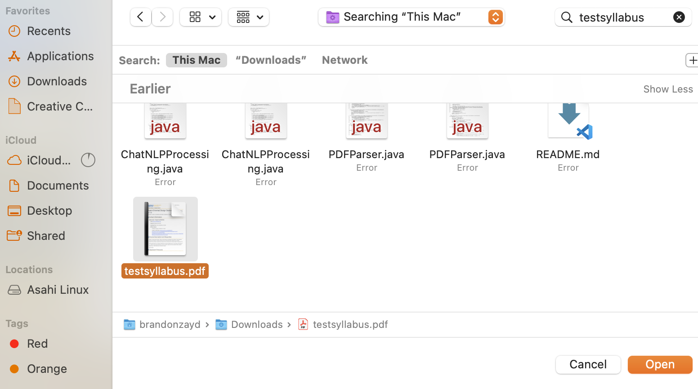  
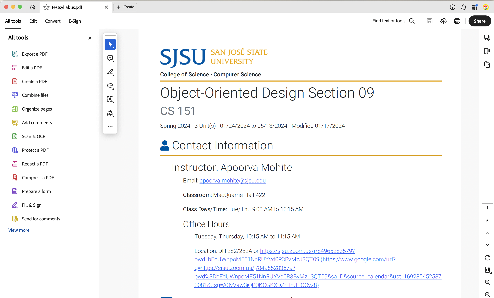  
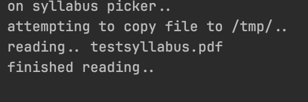  

Now, after attaching your syllabus you can now click on 'Calendar' and view the dates for certain class topics and exam dates. Here are a few snapshots for some of the months that had
important events/topics covered:  

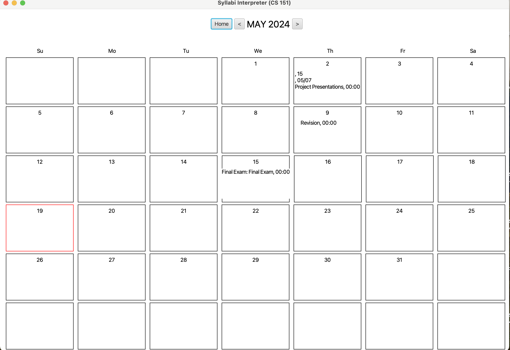 
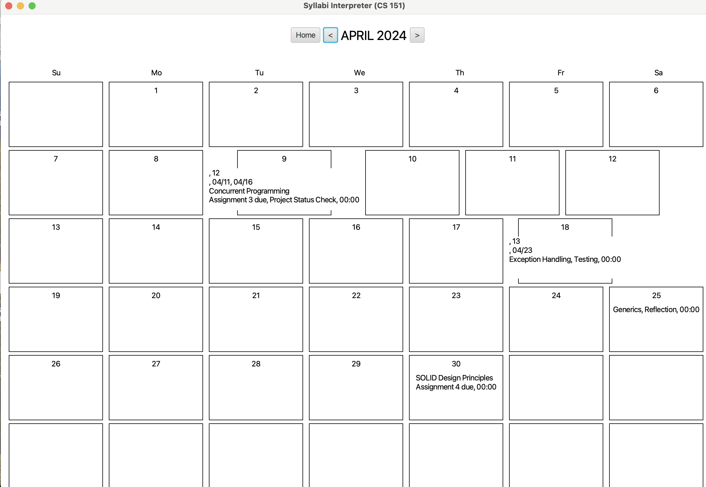 
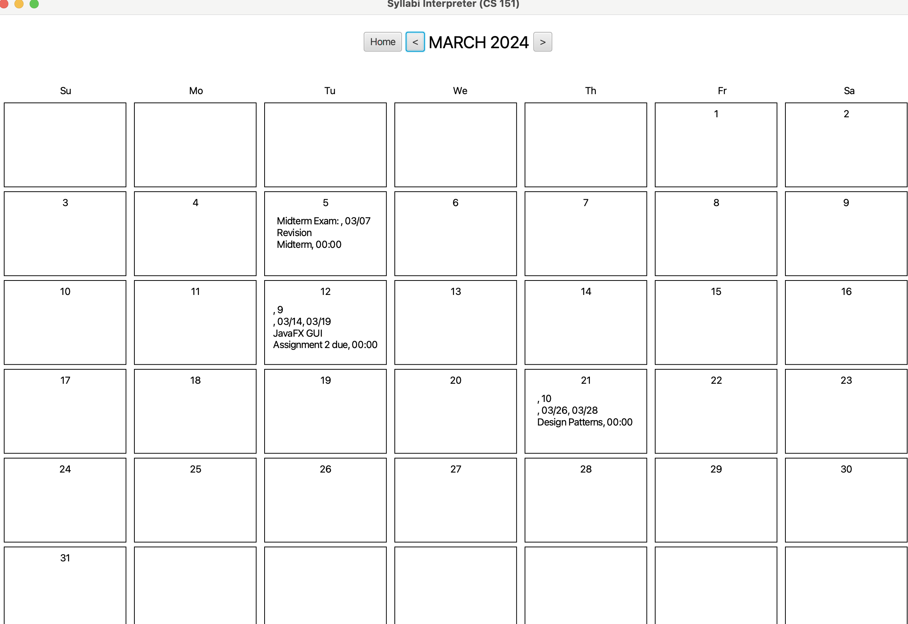 

After looking through your calendar, you can now click 'Home' and head over to your Todo List and look at certain assignments you'll need to do over the semester, lectures to attend, and your exams:

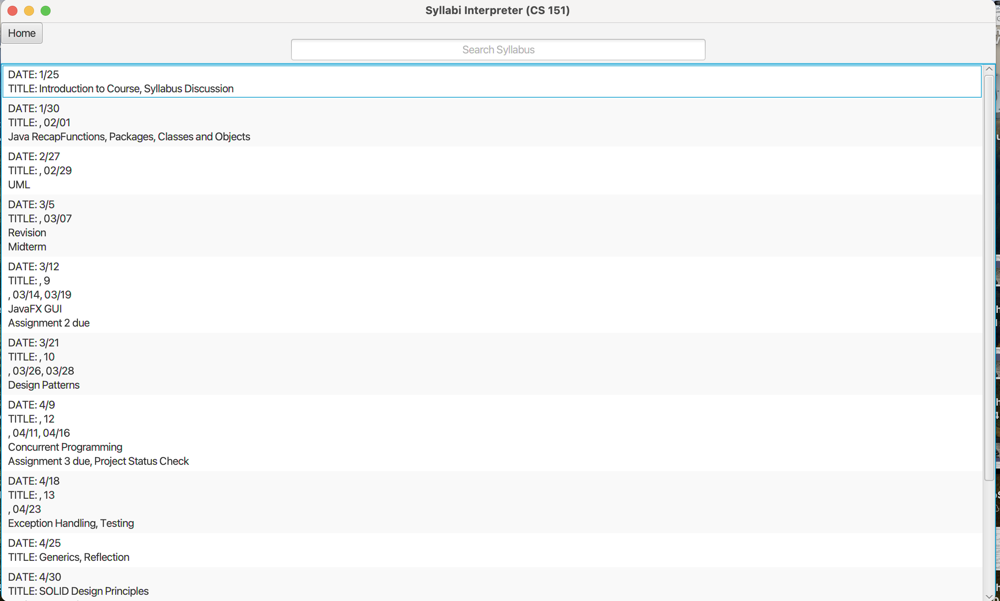 
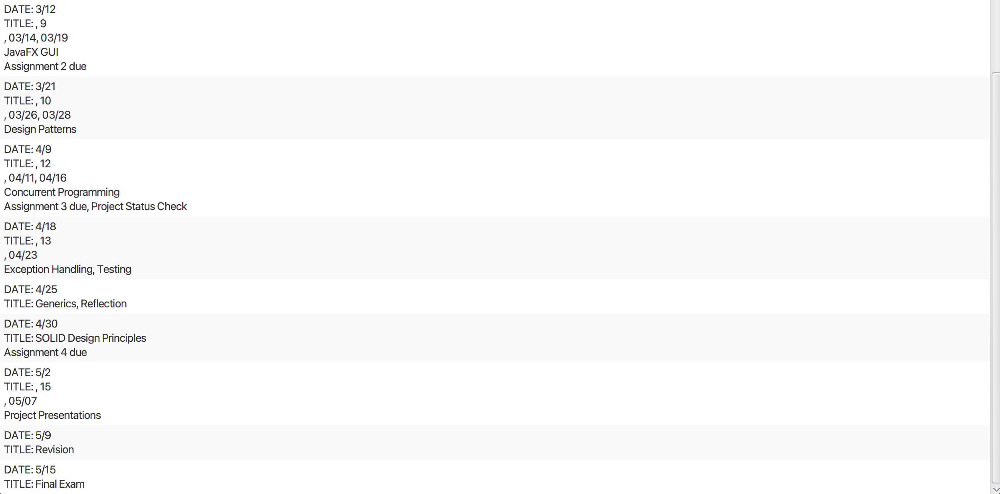 

## Final Overview

Our Syllabi Interpreter was meant to help students manage their workload much more efficiently, we hope that our Syllabi Interpreter could potentially help others or even inspire 
students to take initiative and become more organized! (As well as stopping all procrastination). All links to proposal and slides with more information on Error handling, UI organization, and other design choices will be displayed there! Thank you.

