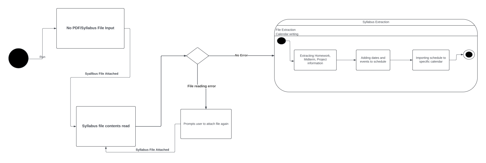
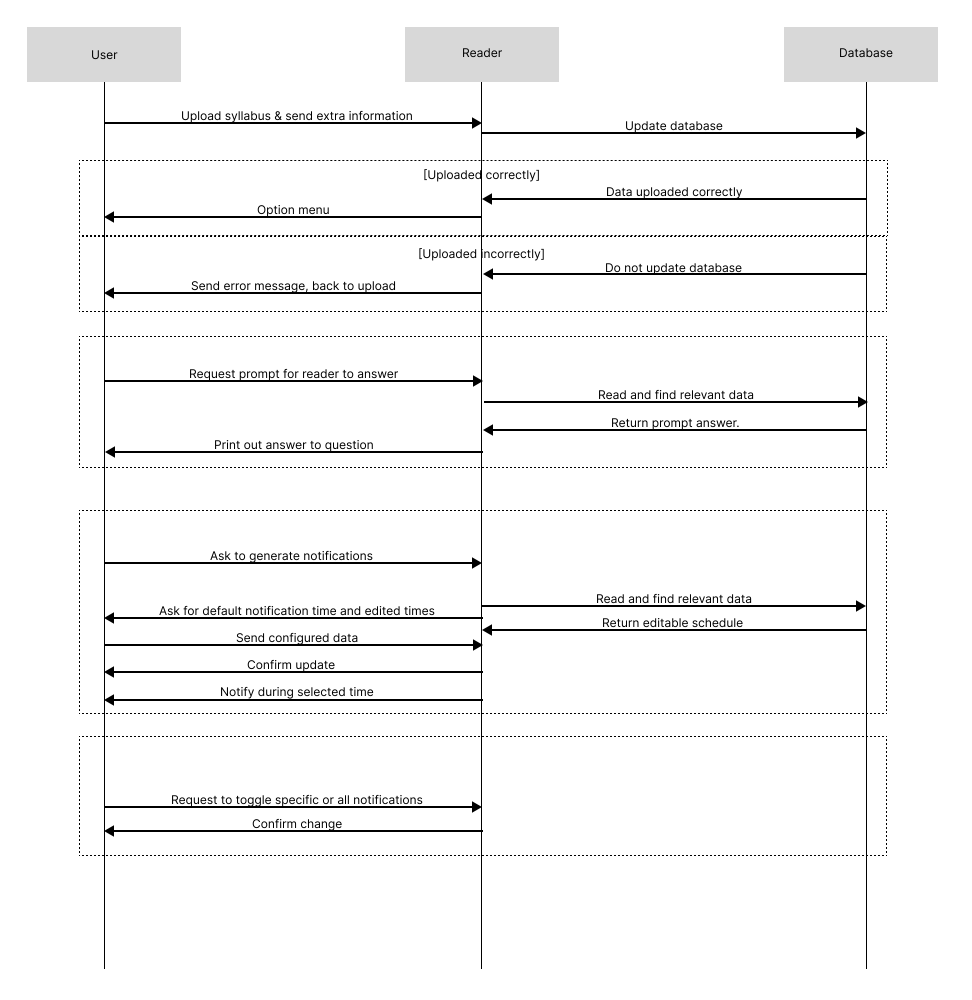
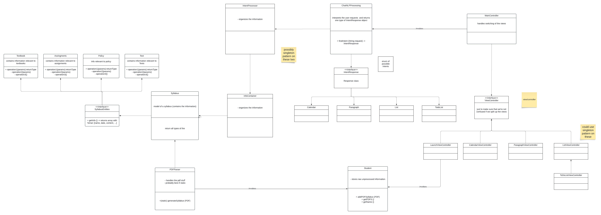

# UML Diagrams : Syllabi Interpreter

### Below is a table with all the diagrams and their description, you may view each file separately by clicking the hyperlinks or viewing them down below. The images down below also include descriptions.

| Diagram | Description |
| ------------- | ------------- |
| [Use Case Diagram](./usecasediagram.png) | The Use Case Diagram shows a graphical representation of possible user interactions. The following use case diagram shows user interaction from a student, teacher, and the chatbot. Each user may interact with different or similar scenarios such as a student & teacher uploading a syllabus and extracting information to then configure class information. The chatbot may view and configure class list on what the student/teacher has extracted based on the syllabus provided and use this information to then make any changes based on what the student or teacher asks for. |
| [State Diagram](./statediagram.png)  | The State Diagram describes the behavior of the program and specific states, such as the reading & extracting of syllabus information. This state diagram starts of at an initial state of no syllabus attached, this is where the user then provides a syllabus to be read. The syllabus provided will then be read and either yield any errors or be ready for extraction. The state of extraction then will begin once the syllabus file is read completely, first the file components will be extracted, then a schedule will be created. Finally, the schedule will be imported to the desired calender (Google Calendar, Outlook calendar, etc.) and then be in an off state after all imports are done. |
| [Sequence Diagram](./sequencediagram.png)  | The Sequence Diagram shows how all operations are carried out in their specific order. The sequence diagram follows the sequence of user,reader, and database. The diagram begins with the user providing a file to be read by the reader who then updates the database with the new syllabus file. If the file is processed correctly then it will update the database, otherwise the user must attach file again. It will then let the user select certain settings such as notifications and other configurations to then update the database with said configurations set by the user. Finally, all changes will be confirmed by user. |
| [Class Diagram](./classdiagram.png) | The Class Diagram displays all of the program's classes, attributes, methods, and relationships they have among each other. The current class diagram demonstrates the possible classes, methods, and functions that may be used in the program. Some classes for FXML Controllers and GUI, methods and classes that involve the parsing of files, etc. |

## Use Case Diagram

### The Use Case Diagram shows a graphical representation of possible user interactions. The following use case diagram shows user interaction from a student, teacher, and the chatbot. Each user may interact with different or similar scenarios such as a student & teacher uploading a syllabus and extracting information to then configure class information. The chatbot may view and configure class list on what the student/teacher has extracted based on the syllabus provided and use this information to then make any changes based on what the student or teacher asks for. 

## State Diagram

### The State Diagram describes the behavior of the program and specific states, such as the reading & extracting of syllabus information. This state diagram starts of at an initial state of no syllabus attached, this is where the user then provides a syllabus to be read. The syllabus provided will then be read and either yield any errors or be ready for extraction. The state of extraction then will begin once the syllabus file is read completely, first the file components will be extracted, then a schedule will be created. Finally, the schedule will be imported to the desired calender (Google Calendar, Outlook calendar, etc.) and then be in an off state after all imports are done.

# Sequence Diagram

### The Sequence Diagram shows how all operations are carried out in their specific order. The sequence diagram follows the sequence of user,reader, and database. The diagram begins with the user providing a file to be read by the reader who then updates the database with the new syllabus file. If the file is processed correctly then it will update the database, otherwise the user must attach file again. It will then let the user select certain settings such as notifications and other configurations to then update the database with said configurations set by the user. Finally, all changes will be confirmed by user. 

# Class Diagram

### The Class Diagram displays all of the program's classes, attributes, methods, and relationships they have among each other. The current class diagram demonstrates the possible classes, methods, and functions that may be used in the program. Some classes for FXML Controllers and GUI, methods and classes that involve the parsing of files, etc.
